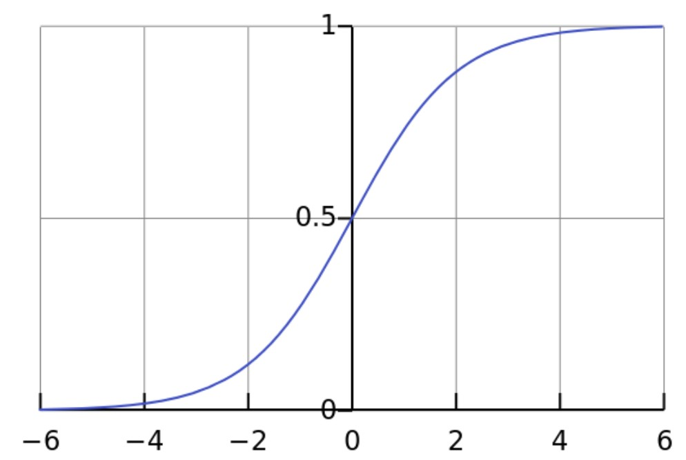
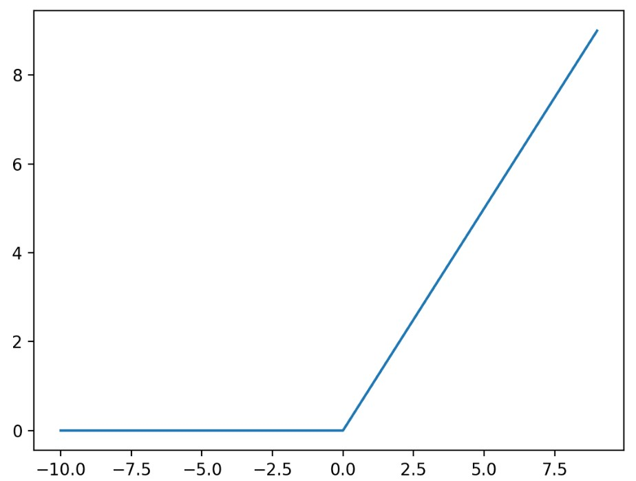
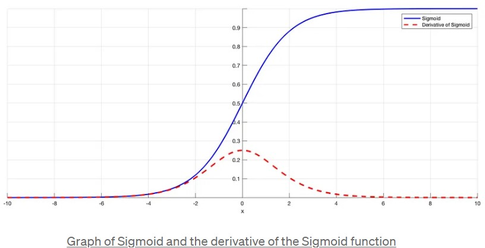
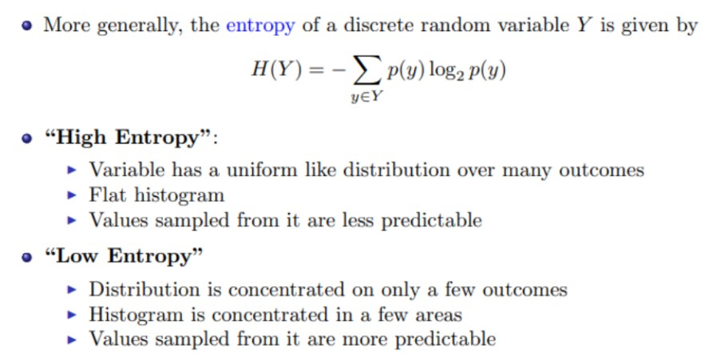
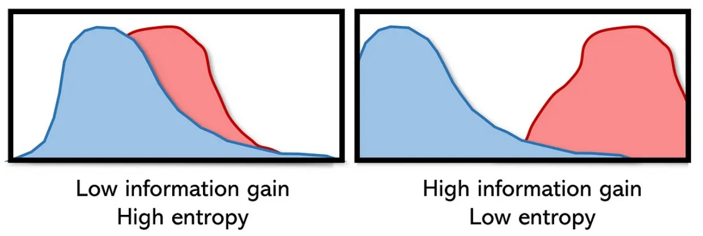
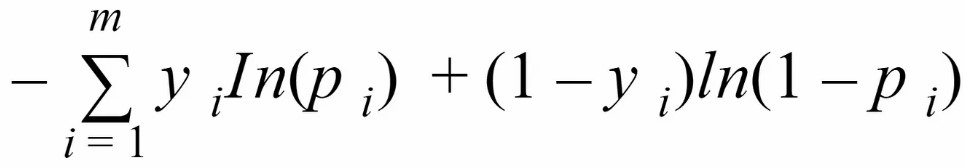
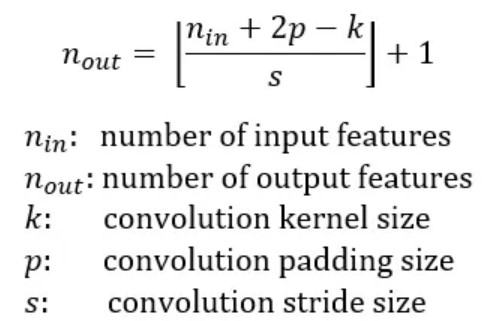
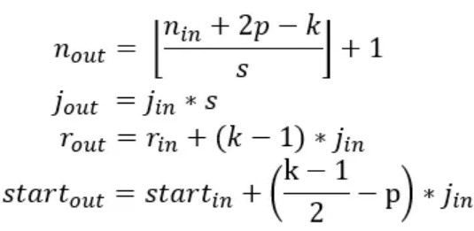
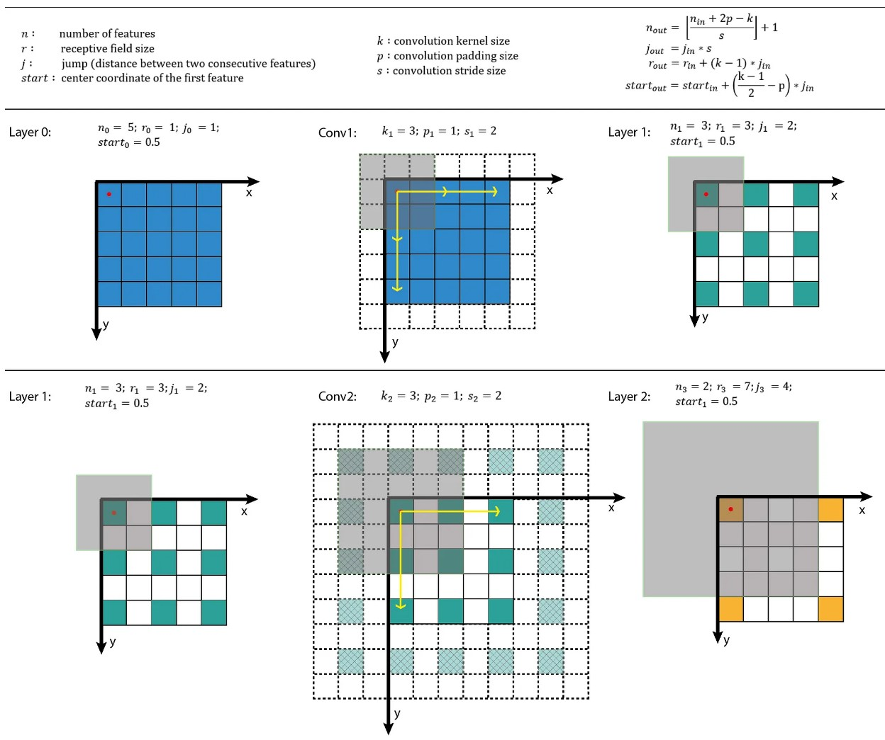

# General Machine Learning
## [What's the trade-off between bias and variance?](https://towardsdatascience.com/understanding-the-bias-variance-tradeoff-165e6942b229)
1. Bias is an error from wrong assumptions about the data, e.g. assuming data is linear when in reality is complex. Model with high bias pays very little attention to the training data and oversimplifies the model. Leads to high error on training and test data.
2. Variance is an error from high sensitivity to small fluctuations in the training set. Model with high variance pays too much attention to the training data and does not generalize on the data it hasn't seen before. Thus performs very well on the training data but very bad on the test data.
3. Why is tradeoff? `Simple model (few parameters) -> high bias and low variance. Complx model -> high variance and low bias.` Thus need good balance without overfitting or underfitting. An optimal balance of bias and variance would never overfit or undefit the model.

## [What is gradient descent?](https://machinelearningmastery.com/gradient-descent-for-machine-learning/)
1. It's an optimization algorithm used to find the values of parameters (coefficients) of a function (f) that minimizes a cost function.
2. Intuition: given parameters `w`, the direction of the largest decrease is `-delta(f(w))`
3. Starts off with random coefficients -> calculate `cost = f(coefficient)` -> calculate derivative to know which way is downhill: `delta = derivative(cost)` -> update the coefficient values `coefficient = coefficient - (alpha * delta)` where `alpha` is the `learning rate` that controls how much the coefficient can change on each update -> repeat until the cost is clost enough to zero
4. **Batch gradient descent (BGD)**: The gradient descent calculated from one batch (iteration) is called the `batch gradient descent`.
5. **Stochastic gradient descent (SGD)**:
- when training set is too large, `batch gradient descent` is very slow (`O(n)`) to predict on each instance.
- `SGD uses the gradient of a randomly-chosen training example from the training set in each iteration, cost is O(1) which is n times faster than BGD`, the coefficients are updated after each training instance, rather than at the end of the batch of instances.
- The order of the training set must be randomized at each iteration to avoid getting stuck.
- SGD might point in the wwrong direction but the expected (average) direction is correct.

## [Explain over- and under-fitting and how to combat them?](https://towardsdatascience.com/overfitting-vs-underfitting-a-complete-example-d05dd7e19765)
1. **Underfitting** heppens when a model is unable to capture the underlying pattern of the data (`high bias and low variance`). Happens when training set is too small or training model is too simple.
2. **Overfitting** happens when model captures the noise along with the underlying pattern in data, i.e. "memorize" the trianing data (`low bias and high variance`). Happens when train model a lot over noisy dataset or model is too complex.
3. **Validation** to avoid overfirtting, but might still overfit to the validation set. Therefore uses **k-fold cross-validation**: 
- Split the training set into subsets called `folds`.
- Each time train on `n-1` of the folds and test on the remaining one.
- Repeat this `n times` and each time uses a different fold for test.
- Finally average the scores for each of the folds to get the overal performance.
- Do k-fold cross-validation for all models and select the model with the lowest cross-validation score which has a good balance between overfitting and underfitting.

## What is stratified cross-validation and when should we use it?
On typical cross-validation this split is done randomly. But in stratified cross-validation, the split preserves the ratio of the categories on both the training and validation datasets.

For example, if we have a dataset with 10% of category A and 90% of category B, and we use stratified cross-validation, we will have the same proportions in training and validation. In contrast, if we use simple cross-validation, in the worst case we may find that there are no samples of category A in the validation set.

Stratified cross-validation may be applied in the following scenarios:

- On a dataset with multiple categories. The smaller the dataset and the more imbalanced the categories, the more important it will be to use stratified cross-validation.
- On a dataset with data of different distributions. For example, in a dataset for autonomous driving, we may have images taken during the day and at night. If we do not ensure that both types are present in training and validation, we will have generalization problems.

## [How do you combat the curse of dimensionality?](https://towardsdatascience.com/why-and-how-to-get-rid-of-the-curse-of-dimensionality-right-with-breast-cancer-dataset-7d528fb5f6c0)
1. **The curse of dimensionality**: when the dimensionality of the `data` increases, the volume of the space increases so fast that the available data becomes sparse and dissimilar. In order to obtain a reliable result, the amount of data needed often `grows exponentially` with the dimensionality. 
2. Solution 1: **Manual feature selection**:
- **The association approach**: for each feature `j`, compute correlation between feature values `xj` and `y` and j is relevant if the correlation is `> 0.9 or < -0.9`. But this ignores variable interactions.
- **The "regression weight" approach**: calculate regression weights on all features and takes the features where its weight is > a certain treshold. `Collinearity` is the major problem.
3. Solution 2: **Principal component analysis (PCA)**
4. Solution 3: **Single value decomposition**: TODO
5. Solution 4: **Multidimensional scaling**: TODO
6. Solution 5: **Locally linear embedding**: TODO

## [What is regularization, why do we use it, and give some examples of common methods?](https://towardsdatascience.com/regularization-in-machine-learning-76441ddcf99a)
1. Besides `cross validation`,  `regularization` is another techinque that avoids overfitting. `Regularization` constrains the cost towards zero. It discourages learning a complex model, reduce variance and avoids overfitting.
2. Regularization increases training error but decreases approximation error.
3. Intuition: large weights tend to lead to overfitting therefore having smaller weights.
4. `Regularization parameter` lambda controls strength of regularization.
Assume loss is **residual sum of squares (RSS)**
### Ridge regression (L2 norm)

1. Adds the “squared magnitude” of the coefficient as the penalty term to the loss function.
2. Will shrink the coefficients for the least important features, but will never make them exactly zero. 
3. Larger coefficients contribute more to the penalty than smaller coefficients. As a result, the penalty term is more influenced by larger coefficients, the model adjusts the coefficients in such a way that the larger coefficients are reduced more than the smaller ones.

### Lasso regression (L1 norm)

1. Adds the “absolute value of magnitude” of the coefficient as a penalty term to the loss function.
2. L1 penalty can force some coefficients to be exactly zero, thus helps in feature selection by eliminating the features that are not important. Thus L1 norm helps with model interpretability.

## [Explain Principle Component Analysis (PCA)?](https://towardsdatascience.com/a-one-stop-shop-for-principal-component-analysis-5582fb7e0a9c)
PCA is a dimensionality reduction technique to reduce the number of features of a dataset while retaining as much information as possible. It works by identifying the directions (principle components) in which the data varies the most and project the data onto a lower-dimensional subspace along these directions (chooses a K-dim subspace to **maximize** the projected variance and project data onto it).

[supplement](http://www.cs.toronto.edu/~rahulgk/courses/csc311_f22/lectures/lec09_annotated_alicegao.pdf)
### Intuition
- PCA takes in `X` (data) and `k` (how many  parts we want to learn) and outputs two matrices `W (PCs)` and `Z (PC scores)`.
- each row of `W (size k*d)` is one principle component
- each row of `Z (size n*k)` is the part weights
- `ZW (size n*d)` is the approximation of the n data points and each row of `ZW` is the approximation of one data point `i.e. xi = zw[i]`
- **Dimensionality reduction**: replace `X` with lower dimensional `Z`, if `k << d` then compress data
 
  
### Steps:
1. Standardize the data.
2. Compute the covariance matrix of the features from the dataset.
3. Perform eigendecompositon on the covariance matrix.
4. Order the eigenvectors in decreasing order based on the magnitude of their corresponding eigenvalues.
5. Determine k, the number of top principal components to select.
6. Construct the projection matrix `W` from the chosen number of top `k` principal components.
7. Compute the C scores `Z = XW`.
8. The approximation is `ZW`

## Why is ReLU better and more often used than Sigmoid in Neural Networks?
1. **Activation functions**: Introduces non-linearity into the output of a neuron. Otherwise, no matter how many layers we have, if all are linear in nature, the final activation function of last layer is nothing but just a linear function of the input of first layer! That means these two layers ( or N layers ) can be replaced by a single layer.
2. **Sigmoid function**: 

3. **ReLU**:

   
### Why is ReLU better than Sigmoid?
1. Computation Efficiency: As ReLU is a simple threshold the forward and backward path will be faster.
2. Reduced Likelihood of Vanishing Gradient: Gradient of ReLU is 1 for positive values and 0 for negative values while Sigmoid activation saturates (gradients close to 0) quickly with slightly higher or lower inputs leading to vanishing gradients.

3. Sparsity: Sparsity happens when the input of ReLU is negative. This means fewer neurons are firing ( sparse activation ) and the network is lighter.

## What is vanishing gradient?
During the backpropogation of each iteration, weights are updated by gradient descent. As we add more and more hidden layers, back propagation becomes less and less useful in passing information to the lower layers. In effect, as information is passed back, the gradients begin to vanish and become small relative to the weights of the networks. In the worst case, this may completely stop the neural network from further training.

## [What is entropy?](https://towardsdatascience.com/understanding-entropy-the-golden-measurement-of-machine-learning-4ea97c663dc3)
Entropy is a measurement of disorder/chaos or uncertainty in a system. The higher the entropy, the more chaos in the system.

For example, roos a coins and ends up with [tails, heads, heads, tails] has high entropy, but [tails, tails, tails, tails] has low entropy.  

A high entroopy means low information gain and low entropy means high information gain.

Statistically, entropy is the "distance" between several probability mass distributions `p(x)`. 

### [What is cross-entropy?](https://towardsdatascience.com/what-is-cross-entropy-3bdb04c13616)
Cross-entropy is a `loss function` often used in classification problems. The cross-entropy formula describes how closely the prediction is to the true values. If it is very close, we have a small cross-entropy and if it is not close we have a high cross-entropy. 
Binary cross-entropy formula:

**Decision tree** use entropy in their construction: in order to be as effective as possible in directing inputs down a series of conditions to a correct outcome, feature splits (conditions) with lower entropy (higher information gain) are placed higher on the tree. Placing the lowest-entropy condition at the top may assist split nodes below it in decreasing entropy.

## Why do ensembles typically have higher scores than individual models?
An ensemble is the combination of multiple models to create a single prediction. The key idea for making better predictions is that the models should make different errors. That way the errors of one model will be compensated by the right guesses of the other models and thus the score of the ensemble will be higher.

We need diverse models for creating an ensemble. Diversity can be achieved by:

- Using different ML algorithms. For example, you can combine logistic regression, k-nearest neighbors, and decision trees.
- Using different subsets of the data for training. This is called **bagging**.
- Giving a different weight to each of the samples of the training set. If this is done iteratively, weighting the samples according to the errors of the ensemble, it’s called **boosting**.

Many winning solutions to data science competitions are ensembles. However, in real-life machine learning projects, engineers need to find a balance between execution time and accuracy.

## Why do we need a validation set and test set? What is the difference between them?
When training a model, we divide the available data into three separate sets:

The training dataset is used for fitting the model’s parameters. However, the accuracy that we achieve on the training set is not reliable for predicting if the model will be accurate on new samples.

The validation dataset is used to measure how well the model does on examples that weren’t part of the training dataset. The metrics computed on the validation data can be used to tune the hyperparameters of the model. However, every time we evaluate the validation data and we make decisions based on those scores, we are leaking information from the validation data into our model. The more evaluations, the more information is leaked. So we can end up overfitting to the validation data, and once again the validation score won’t be reliable for predicting the behaviour of the model in the real world.

The test dataset is used to measure how well the model does on previously unseen examples. It should `only be used once we have tuned the parameters` using the validation set.

So if we omit the test set and only use a validation set, the validation score won’t be a good estimate of the generalization of the model.

## Implement non maximal suppression as efficiently as you can.
Non-Maximum Suppression (NMS) is a technique used to eliminate multiple detections of the same object in a given image. To solve that first sort bounding boxes based on their scores(N LogN). Starting with the box with the highest score, remove boxes whose overlapping metric(IoU) is greater than a certain threshold.(N^2)

To optimize this solution you can use special data structures to query for overlapping boxes such as R-tree or KD-tree. (N LogN)

## What is an imbalanced dataset? Can you list some ways to deal with it? 
An imbalanced dataset is one that has different proportions of target categories. For example, a dataset with medical images where we have to detect some illness will typically have many more negative samples than positive samples—say, 98% of images are without the illness and 2% of images are with the illness.

There are different options to deal with imbalanced datasets:

Oversampling or undersampling. Instead of sampling with a uniform distribution from the training dataset, we can use other distributions so the model sees a more balanced dataset.
Data augmentation. We can add data in the less frequent categories by modifying existing data in a controlled way. In the example dataset, we could flip the images with illnesses, or add noise to copies of the images in such a way that the illness remains visible.
Using appropriate metrics. In the example dataset, if we had a model that always made negative predictions, it would achieve a precision of 98%. There are other metrics such as precision, recall, and F-score that describe the accuracy of the model better when using an imbalanced dataset.

## Can you explain the differences between supervised, unsupervised, and reinforcement learning?
In **supervised learning**, we train a model to `learn the relationship` between input data and output data. We need to have labeled data to be able to do supervised learning.

With **unsupervised learning**, we only have unlabeled data. The model `learns a representation of the data`. Unsupervised learning is frequently used to initialize the parameters of the model when we have a lot of unlabeled data and a small fraction of labeled data. We first train an unsupervised model and, after that, we use the weights of the model to train a supervised model.

In [**reinforcement learning**](https://www.geeksforgeeks.org/what-is-reinforcement-learning/), the model has some input data and a reward depending on the output of the model. The model learns a policy that maximizes the reward. After each action, the algorithm receives feedback that helps it determine whether the choice it made was correct, neutral or incorrect. It is a good technique to use for automated systems that have to make a lot of small decisions without human guidance.

# Computer Vision
## [Given stride S and kernel sizes for each layer of a (1-dimensional) CNN, create a function to compute the receptive field of a particular node in the network. This is just finding how many input nodes actually connect through to a neuron in a CNN.](https://arxiv.org/pdf/1603.07285.pdf)
1. **Padding**: the amount of pixels added to an image when it is being processed.
2. **Stride**: the amount of movement over the image at a time.
### [Receptive field](https://blog.mlreview.com/a-guide-to-receptive-field-arithmetic-for-convolutional-neural-networks-e0f514068807)
Is region in the `input` that produces the feature. The receptive filed of `a particular layer` is is the number of input used by the filter. It's described by its `center location` and its `size`. Within a receptive field, the closer a pixel to the center of the field, the more it contributes to the calculation of the output feature. 
1. Calculation of the `output feature map` size:
   
   
   
   where `p` is the padding size. `k` is the kernel size, `s` is the stride size. 
   Note that if the input image is not a square. need to calculate the feature map separatey for each dimension.
2. Calculation of the `receptive field` size:
   
   
   
   where `j` is the distance between two adjacent features, `r` is the receptive field size, `start` is the the center coordinate of the first (upper-left) feature, which is also the center coordinate of the receptive field.

   Note that the center coordinate of the end feature is `end = start + r-1/2`

### Receptive Field Arithmetic

Note that in the case of an image of size 32x32x3, with a CNN with a filter size of 5x5, the corresponding recpetive field will be the the filter size, 5 multiplied by the depth of the input volume (the RGB colors) which is the color dimensio. This thus gives us a recpetive field of dimension 5x5x3.

## What is batch normalization and why does it work?
Normalization is to transform features to be on a similar scale and helps training. `Batch norm` does the same for the hidden layers. A network is a seires of layers where the output of one layers becomes the input of to the next. Any layer in a neural network is the first layer of a smaller subsequent network. 

The distribution of each layer's inputs changes during the training as the parameters of the previous layers are changed by the backpropagation. Therefore, batch normalization normalizes the inputs of each layer to have mean of 0 and standard deciation of 1. 

This is done for each mini-batch `at each layer`.

The batch normalization can be applied before and after the activation function. However, research shows its best when applied before the activation function.

Batch normalization also helps prevent gradient vanishing. BN makes the network more robust at training.

## How would you remove outliers when trying to estimate a flat plane from noisy samples? 
**Random sample consensus (RANSAC)** is an iterative method to detect outliers.
Two steps: 
1. A sample subset containing minimal data items is randomly selected from the input dataset. A fitting model with model parameters is computed using only the elements of this sample subset. 
2. The algorithm checks which elements of the entire dataset are consistent (`the consensus set`) with the model instantiated by the estimated model parameters obtained from the first step. A data element will be considered as an outlier if it does not fit the model within some error threshold defining the maximum data deviation of inliers. (Data elements beyond this deviation are outliers.)

The RANSAC algorithm will iteratively repeat the above two steps until the obtained consensus set in certain iteration has `enough` inliers.

Note that the model may be improved by re-estimating it by using all the members of the consensus set.

## Describe how convolution works. What about if your inputs are grayscale vs RGB imagery? What determines the shape of the next layer?
In a convolutional neural network (CNN), the convolution operation is applied to the input image using a small matrix called a kernel or filter. The kernel slides over the image in small steps, called strides, and performs element-wise multiplications with the corresponding elements of the image and then sums up the results. The output of this operation is called a feature map.

When the input is RGB(or more than 3 channels) the sliding window will be a sliding cube. The shape of the next layer is determined by Kernel size, number of kernels, stride, padding, and dialation.

## Why do we use convolutions for images rather than just FC layers? 
Firstly, convolutions preserve, encode, and actually use the spatial information from the image. If we used only FC layers (A fully connected layer multiplies the input by a weight matrix and then adds a bias vector) we would have no relative spatial information. Secondly, Convolutional Neural Networks (CNNs) have a partially built-in [translation in-variance](the system produces exactly the same response, regardless of how its input is shifte), since each convolution kernel acts as it's own filter/feature detector.

## Why do we have max-pooling in classification CNNs?
For a role in Computer Vision. Max-pooling in a CNN allows you to reduce computation since your feature maps are smaller after the pooling. You don't lose too much semantic information since you're taking the maximum activation. There's also a theory that max-pooling contributes a bit to giving CNNs more translation in-variance. 

## Why do segmentation CNNs typically have an encoder-decoder style / structure?
The encoder CNN can basically be thought of as a feature extraction network, while the decoder uses that information to predict the image segments by "decoding" the features and upscaling to the original image size.

## What is the significance of Residual Networks?
The main thing that residual connections did was allow for `direct feature access from previous layers`. This makes information propagation throughout the network much easier. One very interesting paper about this shows how using `local skip` connections gives the network a type of ensemble multi-path structure, giving features multiple paths to propagate throughout the network.

## Why would you use many small convolutional kernels such as 3x3 rather than a few large ones?
There are 2 reasons: First, you can use several smaller kernels rather than few large ones to get the same receptive field and capture more spatial context, but with the smaller kernels you are `using less parameters and computations`. Secondly, because with smaller kernels you will be using more filters, you'll be able to use `more activation functions` and thus have a more discriminative mapping function being learned by your CNN.
 
## Talk me through how you would create a 3D model of an object from imagery and depth sensor measurements taken at all angles around the object.
There are two popular methods for 3D reconstruction:
### [Structure from Motion (SfM)](https://www.mathworks.com/help/vision/ug/structure-from-motion.html)
Is the process of estimating the 3-D structure of a scene from a set of 2-D images.
1. Structure from Motion from Two Views
2. Structure from Motion from Multiple Views
### Multi-View Stereo (MVS)
SfM is better suited for creating models of large scenes while MVS is better suited for creating models of small objects.

# ML Models
## Decision Tree
Decision trees are simple programs consisting of a nested sequence of “if-else” decisions based on the features (splitting rules) and A class label as a return value at the end of each sequence.

## What is logistic regression?

# [Some conventions](https://www.baeldung.com/cs/epoch-vs-batch-vs-mini-batch#:~:text=The%20mini%2Dbatch%20is%20a,of%20the%20dataset%20are%20used.)
1. One iteration == one **batch** (the entire training set), the cost is calculated over the entaire training dataset for each iteration.
2. A **mini-batch** is a fixed number of training examples that is < than the actual training set. So in each iteration, we traing the network on a different group of samples unti all samples of the dataset are used.
3. **Epoch** is a changing concept, An epoch means that we have passed each sample of the training set one time through the network to update the parameters. :
   - In batch gradient descent, one epoch corresponds to a single iteration.
   - In stochastic gradient descent, one epoch corresponds to n iterations where n is the number of training samples.
   - In mini-batch gradient descent, one epoch corresponds to \frac{n}{b} iterations where b is the size of the mini-batch.
5. Noise means the data points that don't really represent the true properties of your data.
