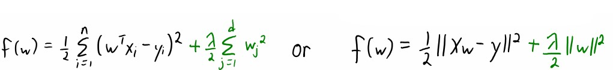
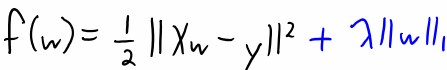
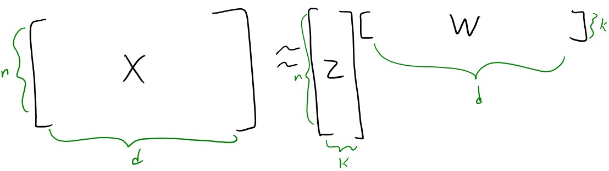
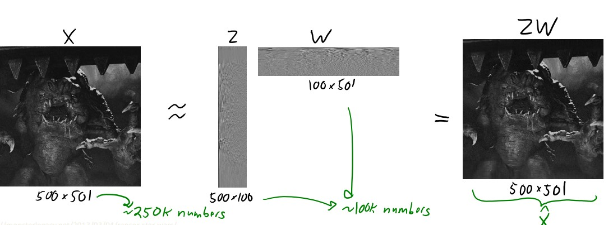

# General Machine Learning
## [What's the trade-off between bias and variance?](https://towardsdatascience.com/understanding-the-bias-variance-tradeoff-165e6942b229)
1. Bias is an error from wrong assumptions about the data, e.g. assuming data is linear when in reality is complex. Model with high bias pays very little attention to the training data and oversimplifies the model. Leads to high error on training and test data.
2. Variance is an error from high sensitivity to small fluctuations in the training set. Model with high variance pays too much attention to the training data and does not generalize on the data it hasn't seen before. Thus performs very well on the training data but very bad on the test data.
3. Why is tradeoff? `Simple model (few parameters) -> high bias and low variance. Complx model -> high variance and low bias.` Thus need good balance without overfitting or underfitting. An optimal balance of bias and variance would never overfit or undefit the model.

## [What is gradient descent?](https://machinelearningmastery.com/gradient-descent-for-machine-learning/)
1. It's an optimization algorithm used to find the values of parameters (coefficients) of a function (f) that minimizes a cost function.
2. Intuition: given parameters `w`, the direction of the largest decrease is `-delta(f(w))`
3. Starts off with random coefficients -> calculate `cost = f(coefficient)` -> calculate derivative to know which way is downhill: `delta = derivative(cost)` -> update the coefficient values `coefficient = coefficient - (alpha * delta)` where `alpha` is the `learning rate` that controls how much the coefficient can change on each update -> repeat until the cost is clost enough to zero
4. **Batch gradient descent (BGD)**: The gradient descent calculated from one batch (iteration) is called the `batch gradient descent`.
5. **Stochastic gradient descent (SGD)**:
- when training set is too large, `batch gradient descent` is very slow (`O(n)`) to predict on each instance.
- `SGD uses the gradient of a randomly-chosen training example from the training set in each iteration, cost is O(1) which is n times faster than BGD`, the coefficients are updated after each training instance, rather than at the end of the batch of instances.
- The order of the training set must be randomized at each iteration to avoid getting stuck.
- SGD might point in the wwrong direction but the expected (average) direction is correct.

## [Explain over- and under-fitting and how to comba them?](https://towardsdatascience.com/overfitting-vs-underfitting-a-complete-example-d05dd7e19765)
1. **Underfitting** heppens when a model is unable to capture the underlying pattern of the data (`high bias and low variance`). Happens when training set is too small or training model is too simple.
2. **Overfitting** happens when model captures the noise along with the underlying pattern in data, i.e. "memorize" the trianing data (`low bias and high variance`). Happens when train model a lot over noisy dataset or model is too complex.
3. **Validation** to avoid overfirtting, but might still overfit to the validation set. Therefore uses **k-fold cross-validation**: 
- Split the training set into subsets called `folds`.
- Each time train on `n-1` of the folds and test on the remaining one.
- Repeat this `n times` and each time uses a different fold for test.
- Finally average the scores for each of the folds to get the overal performance.
- Do k-fold cross-validation for all models and select the model with the lowest cross-validation score which has a good balance between overfitting and underfitting.

## [How do you combat the curse of dimensionality?](https://towardsdatascience.com/why-and-how-to-get-rid-of-the-curse-of-dimensionality-right-with-breast-cancer-dataset-7d528fb5f6c0)
1. **The curse of dimensionality**: when the dimensionality of the `data` increases, the volume of the space increases so fast that the available data becomes sparse and dissimilar. In order to obtain a reliable result, the amount of data needed often `grows exponentially` with the dimensionality. 
2. Solution 1: **Manual feature selection**:
- **The association approach**: for each feature `j`, compute correlation between feature values `xj` and `y` and j is relevant if the correlation is `> 0.9 or < -0.9`. But this ignores variable interactions.
- **The "regression weight" approach**: calculate regression weights on all features and takes the features where its weight is > a certain treshold. `Collinearity` is the major problem.
3. Solution 2: **Principal component analysis (PCA)**
4. Solution 3: **Single value decomposition**: TODO
5. Solution 4: **Multidimensional scaling**: TODO
6. Solution 5: **Locally linear embedding**: TODO

## [What is regularization, why do we use it, and give some examples of common methods?](https://towardsdatascience.com/regularization-in-machine-learning-76441ddcf99a)
1. Besides `cross validation`,  `regularization` is another techinque that avoids overfitting. `Regularization` constrains the cost towards zero. It discourages learning a complex model, reduce variance and avoids overfitting.
2. Regularization increases training error but decreases approximation error.
3. Intuition: large weights tend to lead to overfitting therefore having smaller weights.
4. `Regularization parameter` lambda controls strength of regularization.
Assume loss is **residual sum of squares (RSS)**
### Ridge regression (L2 norm)

1. Adds the “squared magnitude” of the coefficient as the penalty term to the loss function.
2. Will shrink the coefficients for the least important features, but will never make them exactly zero. 
3. Larger coefficients contribute more to the penalty than smaller coefficients. As a result, the penalty term is more influenced by larger coefficients, the model adjusts the coefficients in such a way that the larger coefficients are reduced more than the smaller ones.

### Lasso regression (L1 norm)

1. Adds the “absolute value of magnitude” of the coefficient as a penalty term to the loss function.
2. L1 penalty can force some coefficients to be exactly zero, thus helps in feature selection by eliminating the features that are not important. Thus L1 norm helps with model interpretability.

## [Explain Principle Component Analysis (PCA)?](https://towardsdatascience.com/a-one-stop-shop-for-principal-component-analysis-5582fb7e0a9c)
PCA is a dimensionality reduction technique to reduce the number of features of a dataset while retaining as much information as possible. It works by identifying the directions (principle components) in which the data varies the most and project the data onto a lower-dimensional subspace along these directions (chooses a K-dim subspace to **maximize** the projected variance and project data onto it).

### Intuition
- PCA takes in `X` (data) and `k` (how many  parts we want to learn) and outputs two matrices `W (PCs)` and `Z (PC scores)`.
- each row of `W (size k*d)` is one principle component
- each row of `Z (size n*k)` is the part weights
- `ZW (size n*d)` is the approximation of the n data points and each row of `ZW` is the approximation of one data point `i.e. xi = zw[i]`
- **Dimensionality reduction**: replace `X` with lower dimensional `Z`, if `k << d` then compress data
    
  
### Steps:
1. Standardize the data.
2. Compute the covariance matrix of the features from the dataset.
3. Perform eigendecompositon on the covariance matrix.
4. Order the eigenvectors in decreasing order based on the magnitude of their corresponding eigenvalues.
5. Determine k, the number of top principal components to select.
6. Construct the projection matrix `W` from the chosen number of top `k` principal components.
7. Compute the C scores `Z = XW`.
8. The approximation is `ZW`

# Computer Vision

# Some conventions
1. One iteration == one batch, the cost is calculated over the entaire training dataset for each iteration.
2. Noise means the data points that don't really represent the true properties of your data.
